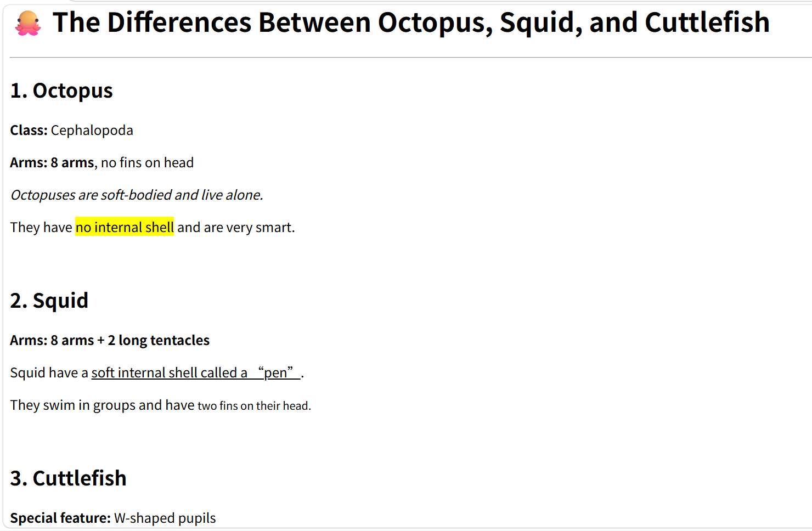

# Unit 1 Reflection

In this unit, I learned about the history of the World Wide Web, how websites work, and the basic building blocks of web development. We started with the background of the Internet and the web, and then moved into HTML, the foundation of all web pages. I practiced using basic HTML structure, headings, paragraphs, and many text formatting tags.
Before this unit, I thought creating a web page would be difficult and confusing. However, after learning and practicing the basic HTML tags, I realized that HTML is much easier than I imagined. With simple tags and clear structure, I can already make a complete, well-formatted webpage.
This unit helped me understand how websites are built from the ground up. I feel more confident now and look forward to learning more about web design and development in future lessons.
